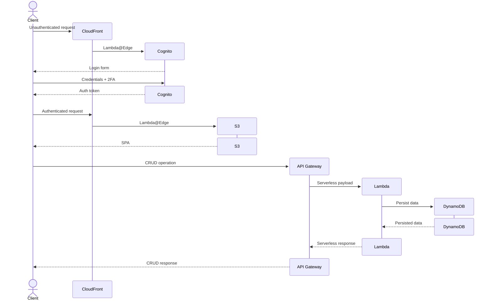

# loose-ends

loose-ends is a lean, productivity-oriented task tracker designed to ensure you tie up all your loose ends.

It is built with a relatively minimal stack and comes eith CDK templates for deployment to AWS.

the AWS deployment is designed to be low-cost, with a serverless backend. a non-exhaustive sequence diagram demonstrating a typical request flow through the relevant services can be found below:

