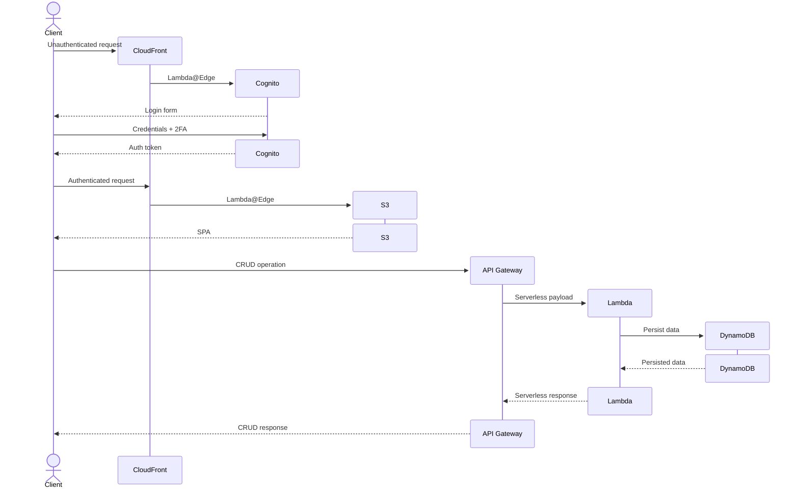

# loose-ends

loose-ends is a lean, productivity-oriented task tracker designed to ensure you tie up all your loose ends.

It is built with a relatively minimal stack and comes eith CDK templates for deployment to AWS.

the AWS deployment is designed to be low-cost, with a serverless backend. a non-exhaustive sequence diagram demonstrating a typical request flow through the relevant services can be found below:

## Concept

The central mechanism in loose-ends is a `timeline`. A `timeline` contains 0 or more `thread`s. If it contains no `thread`s, great job, you have no loose ends, but then why are you here?

`Thread`s are themselves sequences of `event`s. `Event`s are moments in the `timeline`. An `event` is either `past` or `future`. `Past` `event`s must have had one or more `outcome`s. `Future` `event`s may have `expected` `outcome`s; they may also have `reminder`s.

An `outcome` can one of three types:

1. `Initial` - Starting a `thread`
2. `Transitional` - Updating a `thread`
3. `Final` - Ending a `thread`

A `thread` must be associated with exactly one `initial` `outcome`, may have multiple `transitional` `outcome`s, and at most one `final` `outcome`. A `thread` that does not have `final` `outcome` (a `final` `expected outcome` does not count) is considered a `loose end`, thus the name.

loose-ends is built to help ensure you tie up as many loose ends as possible, and that the ones left dangling don't fall through the cracks.

### Example

TODO